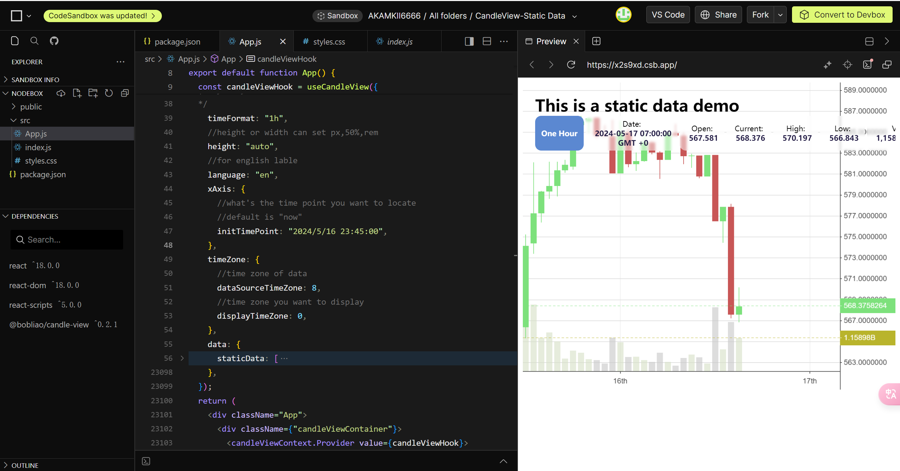
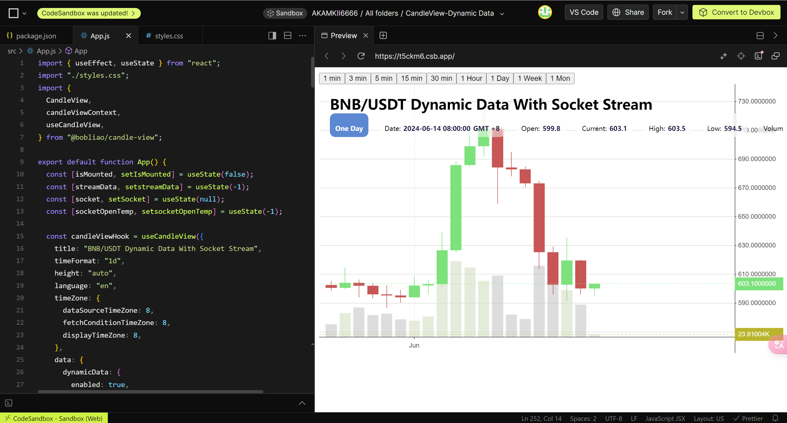
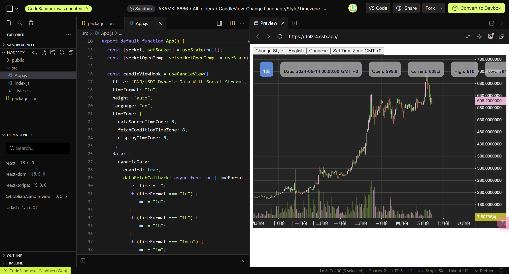
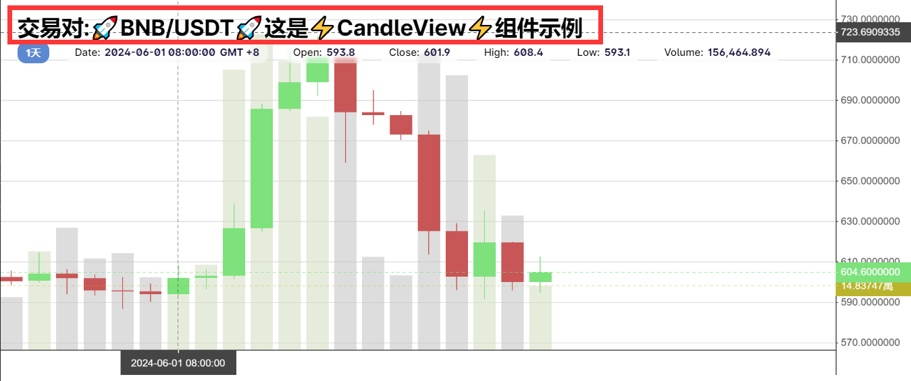
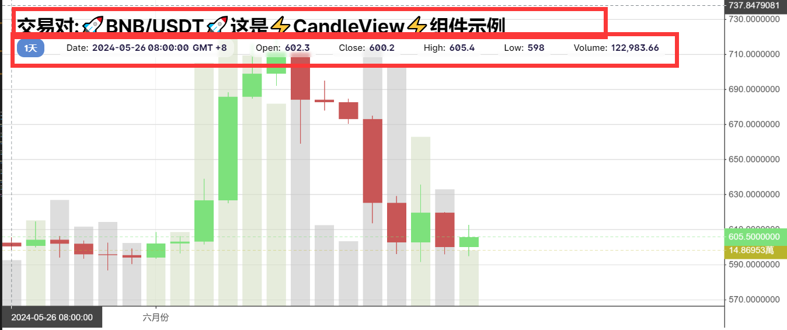

# **🚀CandleView🚀 For Reactjs !**


---

一个用于在 reactjs 中使用的 K 线图组件

---

#### 功能概要

组件用于显示 k 线图以及交易量数据。

---

组件的主要功能:

1. X 轴为日历格式显示,所有在 x 轴上标出的时间为整数时间，可以配置 Formatter

2. Y 轴为自动寻找整数显示，不会显示过多的小数，可以配置 Formatter

3. 支持静态的 k 线数据

4. 支持动态加载 k 线数据

5. 支持动态接入 Websocket 实时价格数据

6. 支持自动聚合时间单位更小的数据，例如您现在给组件设置的单位是月，但是输入的数据的单位为天的，组件将自动聚合到月为单位的数据。

7. 支持时区配置，可以配置输入数据的所在时区 / 显示时以哪个时区显示 / 请求数据时，发送的参数为哪个时区。

8. 时间标签支持中文/英文显示

9. 支持 web 移动端

---

## 如何使用

```bash
yarn add @bobliao/candle-view@latest
```

```bash
npm i @bobliao/candle-view@latest
```

引用到您想使用的位置:

```javascript
import {
  useCandleView,
  candleViewContext,
  CandleView,
} from '@bobliao/candle-view';
```

使用钩子初始化 CandleView:

```javascript
//这里仅作演示，下文将提及详细的配置字段和使用
const candleViewHook = useCandleView({
  timeFormat: '1d',
  height: 'auto',
  timeZone: {
    dataSourceTimeZone: 8,
    fetchConditionTimeZone: 8,
    displayTimeZone: 8,
  },
  data: {
    dynamicData: {
      enabled: true,
      dataFetchCallback: async function(timeFormat, startTime, endTime) {
        let time = '';
        if (timeFormat === '1d') {
          time = '1d';
        }
        if (timeFormat === '1h') {
          time = '1h';
        }
        if (timeFormat === '1min') {
          time = '1m';
        }
        let response = await fetch(`
                        https://api.binance.com/api/v3/klines?symbol=BNBUSDT&interval=
                        ${time}
                        &startTime=
                        ${startTime}
                        &endTime=
                        ${endTime}
                    `).then(function(d: any) {
          return d.json();
        });

        let bars: IcandleItem[] = [];

        for (var item of response) {
          bars.push({
            time: item[0],
            low: item[3],
            high: item[2],
            open: item[1],
            close: item[4],
            volume: Number(item[5]),
          });
        }
        return bars;
      },
    },
  },
});
```

将 CandleView 放到您的组件中去:

```javascript
<div className={'candleviewContainer'}>
  <candleViewContext.Provider value={candleViewHook}>
    <CandleView></CandleView>
  </candleViewContext.Provider>
</div>
```

## 示例

---

静态数据：



<div>
<a target="blank" href="https://codesandbox.io/p/sandbox/candleview-static-data-x2s9xd?file=%2Fsrc%2Findex.js&layout=%257B%2522sidebarPanel%2522%253A%2522EXPLORER%2522%252C%2522rootPanelGroup%2522%253A%257B%2522direction%2522%253A%2522horizontal%2522%252C%2522contentType%2522%253A%2522UNKNOWN%2522%252C%2522type%2522%253A%2522PANEL_GROUP%2522%252C%2522id%2522%253A%2522ROOT_LAYOUT%2522%252C%2522panels%2522%253A%255B%257B%2522type%2522%253A%2522PANEL_GROUP%2522%252C%2522contentType%2522%253A%2522UNKNOWN%2522%252C%2522direction%2522%253A%2522vertical%2522%252C%2522id%2522%253A%2522clxdyzvmx0006356klq4xkzsr%2522%252C%2522sizes%2522%253A%255Bnull%252Cnull%255D%252C%2522panels%2522%253A%255B%257B%2522type%2522%253A%2522PANEL_GROUP%2522%252C%2522contentType%2522%253A%2522EDITOR%2522%252C%2522direction%2522%253A%2522horizontal%2522%252C%2522id%2522%253A%2522EDITOR%2522%252C%2522panels%2522%253A%255B%257B%2522type%2522%253A%2522PANEL%2522%252C%2522contentType%2522%253A%2522EDITOR%2522%252C%2522id%2522%253A%2522clxdyzvmx0002356k1amvme3h%2522%257D%255D%257D%252C%257B%2522type%2522%253A%2522PANEL_GROUP%2522%252C%2522contentType%2522%253A%2522SHELLS%2522%252C%2522direction%2522%253A%2522horizontal%2522%252C%2522id%2522%253A%2522SHELLS%2522%252C%2522panels%2522%253A%255B%257B%2522type%2522%253A%2522PANEL%2522%252C%2522contentType%2522%253A%2522SHELLS%2522%252C%2522id%2522%253A%2522clxdyzvmx0003356k61yfun4c%2522%257D%255D%252C%2522sizes%2522%253A%255B100%255D%257D%255D%257D%252C%257B%2522type%2522%253A%2522PANEL_GROUP%2522%252C%2522contentType%2522%253A%2522DEVTOOLS%2522%252C%2522direction%2522%253A%2522vertical%2522%252C%2522id%2522%253A%2522DEVTOOLS%2522%252C%2522panels%2522%253A%255B%257B%2522type%2522%253A%2522PANEL%2522%252C%2522contentType%2522%253A%2522DEVTOOLS%2522%252C%2522id%2522%253A%2522clxdyzvmx0005356krw1hkkot%2522%257D%255D%252C%2522sizes%2522%253A%255B100%255D%257D%255D%252C%2522sizes%2522%253A%255B50%252C50%255D%257D%252C%2522tabbedPanels%2522%253A%257B%2522clxdyzvmx0002356k1amvme3h%2522%253A%257B%2522tabs%2522%253A%255B%257B%2522id%2522%253A%2522clxdyzvmx0001356kahkhij8o%2522%252C%2522mode%2522%253A%2522permanent%2522%252C%2522type%2522%253A%2522FILE%2522%252C%2522filepath%2522%253A%2522%252Fsrc%252Findex.js%2522%252C%2522state%2522%253A%2522IDLE%2522%257D%255D%252C%2522id%2522%253A%2522clxdyzvmx0002356k1amvme3h%2522%252C%2522activeTabId%2522%253A%2522clxdyzvmx0001356kahkhij8o%2522%257D%252C%2522clxdyzvmx0005356krw1hkkot%2522%253A%257B%2522tabs%2522%253A%255B%257B%2522id%2522%253A%2522clxdyzvmx0004356k8rpap7y9%2522%252C%2522mode%2522%253A%2522permanent%2522%252C%2522type%2522%253A%2522UNASSIGNED_PORT%2522%252C%2522port%2522%253A0%252C%2522path%2522%253A%2522%252F%2522%257D%255D%252C%2522id%2522%253A%2522clxdyzvmx0005356krw1hkkot%2522%252C%2522activeTabId%2522%253A%2522clxdyzvmx0004356k8rpap7y9%2522%257D%252C%2522clxdyzvmx0003356k61yfun4c%2522%253A%257B%2522tabs%2522%253A%255B%255D%252C%2522id%2522%253A%2522clxdyzvmx0003356k61yfun4c%2522%257D%257D%252C%2522showDevtools%2522%253Atrue%252C%2522showShells%2522%253Afalse%252C%2522showSidebar%2522%253Atrue%252C%2522sidebarPanelSize%2522%253A15%257D" >前往CodeSandBox查看</a>
</div>

动态数据（动态加载历史数据，websocket 加载实时价格）：



<div>
<a target="blank" href="https://codesandbox.io/p/sandbox/candleview-dynamic-data-t5ckm6?layout=%257B%2522sidebarPanel%2522%253A%2522EXPLORER%2522%252C%2522rootPanelGroup%2522%253A%257B%2522direction%2522%253A%2522horizontal%2522%252C%2522contentType%2522%253A%2522UNKNOWN%2522%252C%2522type%2522%253A%2522PANEL_GROUP%2522%252C%2522id%2522%253A%2522ROOT_LAYOUT%2522%252C%2522panels%2522%253A%255B%257B%2522type%2522%253A%2522PANEL_GROUP%2522%252C%2522contentType%2522%253A%2522UNKNOWN%2522%252C%2522direction%2522%253A%2522vertical%2522%252C%2522id%2522%253A%2522clxe3aqgu0006356lmvp8mim7%2522%252C%2522sizes%2522%253A%255B100%252C0%255D%252C%2522panels%2522%253A%255B%257B%2522type%2522%253A%2522PANEL_GROUP%2522%252C%2522contentType%2522%253A%2522EDITOR%2522%252C%2522direction%2522%253A%2522horizontal%2522%252C%2522id%2522%253A%2522EDITOR%2522%252C%2522panels%2522%253A%255B%257B%2522type%2522%253A%2522PANEL%2522%252C%2522contentType%2522%253A%2522EDITOR%2522%252C%2522id%2522%253A%2522clxe3aqgt0002356l9b37wxdx%2522%257D%255D%257D%252C%257B%2522type%2522%253A%2522PANEL_GROUP%2522%252C%2522contentType%2522%253A%2522SHELLS%2522%252C%2522direction%2522%253A%2522horizontal%2522%252C%2522id%2522%253A%2522SHELLS%2522%252C%2522panels%2522%253A%255B%257B%2522type%2522%253A%2522PANEL%2522%252C%2522contentType%2522%253A%2522SHELLS%2522%252C%2522id%2522%253A%2522clxe3aqgt0003356lrllv4kmk%2522%257D%255D%252C%2522sizes%2522%253A%255B100%255D%257D%255D%257D%252C%257B%2522type%2522%253A%2522PANEL_GROUP%2522%252C%2522contentType%2522%253A%2522DEVTOOLS%2522%252C%2522direction%2522%253A%2522vertical%2522%252C%2522id%2522%253A%2522DEVTOOLS%2522%252C%2522panels%2522%253A%255B%257B%2522type%2522%253A%2522PANEL%2522%252C%2522contentType%2522%253A%2522DEVTOOLS%2522%252C%2522id%2522%253A%2522clxe3aqgt0005356lit6wbcwo%2522%257D%255D%252C%2522sizes%2522%253A%255B100%255D%257D%255D%252C%2522sizes%2522%253A%255B41.04580421338427%252C58.95419578661573%255D%257D%252C%2522tabbedPanels%2522%253A%257B%2522clxe3aqgt0002356l9b37wxdx%2522%253A%257B%2522tabs%2522%253A%255B%257B%2522id%2522%253A%2522clxe3aqgt0001356lnpxq8cn4%2522%252C%2522mode%2522%253A%2522permanent%2522%252C%2522type%2522%253A%2522FILE%2522%252C%2522filepath%2522%253A%2522%252Fsrc%252Findex.js%2522%257D%255D%252C%2522id%2522%253A%2522clxe3aqgt0002356l9b37wxdx%2522%252C%2522activeTabId%2522%253A%2522clxe3aqgt0001356lnpxq8cn4%2522%257D%252C%2522clxe3aqgt0005356lit6wbcwo%2522%253A%257B%2522tabs%2522%253A%255B%257B%2522id%2522%253A%2522clxe3aqgt0004356lnf702k5s%2522%252C%2522mode%2522%253A%2522permanent%2522%252C%2522type%2522%253A%2522UNASSIGNED_PORT%2522%252C%2522port%2522%253A0%252C%2522path%2522%253A%2522%252F%2522%257D%255D%252C%2522id%2522%253A%2522clxe3aqgt0005356lit6wbcwo%2522%252C%2522activeTabId%2522%253A%2522clxe3aqgt0004356lnf702k5s%2522%257D%252C%2522clxe3aqgt0003356lrllv4kmk%2522%253A%257B%2522tabs%2522%253A%255B%255D%252C%2522id%2522%253A%2522clxe3aqgt0003356lrllv4kmk%2522%257D%257D%252C%2522showDevtools%2522%253Atrue%252C%2522showShells%2522%253Afalse%252C%2522showSidebar%2522%253Atrue%252C%2522sidebarPanelSize%2522%253A15%257D" >前往CodeSandBox查看</a>
</div>

样式 / 语言 / 显示时区更改：



<div>
<a target="blank" href="https://codesandbox.io/p/sandbox/candleview-change-language-style-timezone-dhlzr4?layout=%257B%2522sidebarPanel%2522%253A%2522EXPLORER%2522%252C%2522rootPanelGroup%2522%253A%257B%2522direction%2522%253A%2522horizontal%2522%252C%2522contentType%2522%253A%2522UNKNOWN%2522%252C%2522type%2522%253A%2522PANEL_GROUP%2522%252C%2522id%2522%253A%2522ROOT_LAYOUT%2522%252C%2522panels%2522%253A%255B%257B%2522type%2522%253A%2522PANEL_GROUP%2522%252C%2522contentType%2522%253A%2522UNKNOWN%2522%252C%2522direction%2522%253A%2522vertical%2522%252C%2522id%2522%253A%2522clxef4uj90006356l2c9wqdcw%2522%252C%2522sizes%2522%253A%255B100%252C0%255D%252C%2522panels%2522%253A%255B%257B%2522type%2522%253A%2522PANEL_GROUP%2522%252C%2522contentType%2522%253A%2522EDITOR%2522%252C%2522direction%2522%253A%2522horizontal%2522%252C%2522id%2522%253A%2522EDITOR%2522%252C%2522panels%2522%253A%255B%257B%2522type%2522%253A%2522PANEL%2522%252C%2522contentType%2522%253A%2522EDITOR%2522%252C%2522id%2522%253A%2522clxef4uj90002356l7dj6a54c%2522%257D%255D%257D%252C%257B%2522type%2522%253A%2522PANEL_GROUP%2522%252C%2522contentType%2522%253A%2522SHELLS%2522%252C%2522direction%2522%253A%2522horizontal%2522%252C%2522id%2522%253A%2522SHELLS%2522%252C%2522panels%2522%253A%255B%257B%2522type%2522%253A%2522PANEL%2522%252C%2522contentType%2522%253A%2522SHELLS%2522%252C%2522id%2522%253A%2522clxef4uj90003356lcbocrjlg%2522%257D%255D%252C%2522sizes%2522%253A%255B100%255D%257D%255D%257D%252C%257B%2522type%2522%253A%2522PANEL_GROUP%2522%252C%2522contentType%2522%253A%2522DEVTOOLS%2522%252C%2522direction%2522%253A%2522vertical%2522%252C%2522id%2522%253A%2522DEVTOOLS%2522%252C%2522panels%2522%253A%255B%257B%2522type%2522%253A%2522PANEL%2522%252C%2522contentType%2522%253A%2522DEVTOOLS%2522%252C%2522id%2522%253A%2522clxef4uj90005356lrm0x3pzv%2522%257D%255D%252C%2522sizes%2522%253A%255B100%255D%257D%255D%252C%2522sizes%2522%253A%255B45.30946754487405%252C54.69053245512595%255D%257D%252C%2522tabbedPanels%2522%253A%257B%2522clxef4uj90002356l7dj6a54c%2522%253A%257B%2522tabs%2522%253A%255B%257B%2522id%2522%253A%2522clxef4uj90001356li3413coe%2522%252C%2522mode%2522%253A%2522permanent%2522%252C%2522type%2522%253A%2522FILE%2522%252C%2522filepath%2522%253A%2522%252Fsrc%252Findex.js%2522%257D%255D%252C%2522id%2522%253A%2522clxef4uj90002356l7dj6a54c%2522%252C%2522activeTabId%2522%253A%2522clxef4uj90001356li3413coe%2522%257D%252C%2522clxef4uj90005356lrm0x3pzv%2522%253A%257B%2522tabs%2522%253A%255B%257B%2522id%2522%253A%2522clxef4uj90004356lvzltvamv%2522%252C%2522mode%2522%253A%2522permanent%2522%252C%2522type%2522%253A%2522UNASSIGNED_PORT%2522%252C%2522port%2522%253A0%252C%2522path%2522%253A%2522%252F%2522%257D%255D%252C%2522id%2522%253A%2522clxef4uj90005356lrm0x3pzv%2522%252C%2522activeTabId%2522%253A%2522clxef4uj90004356lvzltvamv%2522%257D%252C%2522clxef4uj90003356lcbocrjlg%2522%253A%257B%2522tabs%2522%253A%255B%255D%252C%2522id%2522%253A%2522clxef4uj90003356lcbocrjlg%2522%257D%257D%252C%2522showDevtools%2522%253Atrue%252C%2522showShells%2522%253Afalse%252C%2522showSidebar%2522%253Atrue%252C%2522sidebarPanelSize%2522%253A15%257D" >前往CodeSandBox查看</a>
</div>

---

配置详解

当您使用 useCandleView 钩子时，需要传入配置{.....}，下文将把所有可配置项列出

```javascript
const candleViewHook = useCandleView({.....});
```

标题配置：



```javascript
const candleViewHook = useCandleView({
  //这里设置组件的标题，可以接受string,以及jsx
  title: 'This is title here',
});
```

Candle 的信息/标题的显示:



```javascript
const candleViewHook = useCandleView({
  //这里设置标题是否显示
  enableTitle: true,
  //这里设置candle信息是否显示
  enableinfo: true,
});
```

静态数据格式:

```javascript
const candleViewHook = useCandleView({
  data: {
    staticData: [
      ...
      {
        //时间，只接受13位时间戳数字格式，请自行处理
        time: 1715874300000,
        //开盘价格
        open: 568.1485329113463,
        //最高价格
        high: 568.6032108510848,
        //最低价格
        low: 567.6374548048495,
        //收盘价格
        close: 568.3758264156954,
        //成交量
        volume: 163449516.83591747,
      },
      ...
    ],
  },
});
```

所有配置项目:

```javascript
const candleViewHook = useCandleView({
  //标题
  title: 'Set Your Title',
  //是否显示标题
  enableTitle: true,
  //是否显示candle信息
  enableinfo: true,
  //所输入数据的时间单位,支持:
  // "1min"| "2min"| "3min"| "5min"| "10min"| "15min"| "30min"| "1h"| "1d"| "1w"| "1m"| "1y"
  timeFormat: '1h',
  //宽度，接受 “14px” / "100%" / "14" / "auto"
  //使用"auto"之后组件大小随器容器变化
  width: 'auto',
  //高度，接受 “14px” / "100%" / "14" / "auto"
  //使用"auto"之后组件大小随器容器变化
  height: '500px',
  //背景颜色
  backgroundColor: '#fff',
  //组件尺寸(width/height)填写了"auto"之后随容器大小变化时的Debounce
  //填写0为不进行防抖处理
  resizeDebounceTime: 100,
  //组件显示语言
  language: 'zh',
  //时区设定
  timeZone: {
    //设置输入数据的所在时区
    //例如当前数据是使用的GMT +0000(格林威治标准时间)
    //那么此处这设置为0
    dataSourceTimeZone: 0,
    //动态获取数据时传递给 config.data.dynamic.dataFetchCallback()的开始结束时间戳
    //需要用哪个时区的时间,例如你的数据接口只接受时区为0的时间，那么此处填0
    fetchConditionTimeZone: 0,
    //x轴以及tooltip显示时设定到哪个时区，例如我希望无论数据源的时间是哪个时区，我希望以北京时间显示
    //那么这里填写8
    displayTimeZone: 0,
  },
  //y轴配置
  yAxis: {
    //y轴留给label显示的空间 接受 “14px” / "20%" / "14"
    labelSpace: '90px',
    //y轴的格式器
    formatter: function(axisItem) {
      return axisItem.displayValue.toString();
    },
    //字体大小
    fontSize: '12px',
    //网格线颜色
    netLineColor: '#dedede',
    //y轴线颜色
    lineColor: '#454545',
    //设置y轴指针和字体的颜色
    tickColor: '#454545',
    //指针长度
    tickLength: '3px',
    //网格线的粗细
    netLineSize: 0.5,
    //y轴指针最大出现数量
    netLineMaxCount: 14,
    //y轴指针最小出现数量现数量
    netLineMinCount: 3,
    //y轴上下较总高度空出百分之多少距离，1为100%
    displayPadding: 0.3,
    //y轴tooltip设置
    tooltip: {
      //是否打开y轴tooltip
      enabled: true,
      //tooltip线的颜色
      color: '#02121c',
      //tooltip线的粗细
      lineSize: 0.5,
      //实线的长度
      dashLength: 4,
      //虚部的长度
      spaceLength: 3,
      //tooltip的label显示设置
      label: {
        //字体大小，只接收数字，单位px
        fontsize: 12,
        //字体颜色以及tick颜色
        color: '#ffffff',
        //背景颜色
        backGroundColor: '#454545',
        //背景的透明度
        backGroundAlpha: 1,
        //tooltip文字的formatter
        formatter: function(axisItem) {
          axisItem = axisItem;
          //yyyy-MM-dd HH:mm:ss
          return axisItem.displayValue;
        },
      },
    },
  },
  //x轴配置
  xAxis: {
    //x轴留给label显示的空间 接受 “14px” / "20%" / "14"
    labelSpace: '30px',
    //x轴的格式器
    formatter: function(axisItem) {
      return axisItem.displayValue.toString();
    },
    //字体大小
    fontSize: '12px',
    //网格线颜色
    netLineColor: '#dedede',
    //y轴线颜色
    lineColor: '#454545',
    //设置x轴指针和字体的颜色
    tickColor: '#454545',
    //指针长度
    tickLength: '4px',
    //网格线的粗细
    netLineSize: 0.5,
    //将初始时间定位到哪个时间点，默认“现在”
    initTimePoint: 'now',
    //x轴较x轴宽度往外伸展的比率 默认0
    displayPadding: 0,
    //x轴tooltip设置
    tooltip: {
      //是否开启x轴tooltip
      enabled: true,
      //tooltip线的颜色
      color: '#02121c',
      //tooltip线的粗细
      lineSize: 0.5,
      //实线的长度
      dashLength: 4,
      //虚部的长度
      spaceLength: 3,
      //tooltip的label显示设置
      label: {
        //字体大小，只接收数字，单位px
        fontsize: 12,
        //字体颜色以及tick颜色
        color: '#ffffff',
        //背景颜色
        backGroundColor: '#454545',
        //背景的透明度
        backGroundAlpha: 1,
        //tooltip文字的formatter
        formatter: function(axisItem) {
          //yyyy-MM-dd HH:mm:ss
          return formatDate(new Date(axisItem.value), 'yyyy-MM-dd HH:mm:ss');
        },
      },
    },
  },
  //数据设置
  data: {
    //填入静态数据
    //若填入静态数据将忽略所有动态数据的配置
    staticData: [],
    //动态数据
    dynamicData: {
      //是否开启动态数据
      enabled: false,
      //是否在每次分段加载数据时显示loading画面
      showLoading: false,
      //是否在加载数据时阻断用户操作
      stopUserOperateWhenLoading: false,
      //每次加载数据的时间单位跨度，默认两百
      dataFetchCountPreTime: 200,
      //加载数据的处理函数，详情请看codesandbox示例
      dataFetchCallback: async function(time, start, end) {
        return [];
      },
    },
    //数据的展示样式配置
    candleStyles: {
      //每个candle的宽度 值接受百分比
      candleWidth: '80%',
      //每个wick（也就是现实high,low那个小条条）的宽度
      wickWidth: '1px',
      //张时的candle颜色
      candleRiseColor: '#7de17c',
      //跌时的candle颜色
      candleFallColor: '#c85656',
      //张时的wick颜色
      wickRiseColor: '#7de17c',
      //跌时的wick颜色
      wickFallColor: '#c85656',
      //当前最末尾价格的tooltip设置
      currentPriceTooltip: {
        //是否打开tooltip
        enabled: true,
        //tooltip线的颜色
        color: '#b9b42c',
        //tooltip线的粗细
        lineSize: 0.5,
        //实线的长度
        dashLength: 8,
        //虚部的长度
        spaceLength: 3,
        //tooltip的label显示设置
        label: {
          //字体大小，只接收数字，单位px
          fontsize: 12,
          //字体颜色以及tick颜色
          color: '#ffffff',
          //背景颜色
          backGroundColor: '#b9b42c',
          //背景的透明度
          backGroundAlpha: 1,
          //tooltip文字的formatter
          formatter: function(axisItem) {
            axisItem = axisItem;
            //yyyy-MM-dd HH:mm:ss
            return axisItem.displayValue;
          },
        },
      },
      //当前显示范围的最末尾的tooltip设置
      viewLastPriceTooltip: {
        //是否打开tooltip
        enabled: true,
        //tooltip线的颜色
        color: '#b9b42c',
        //tooltip线的粗细
        lineSize: 0.5,
        //实线的长度
        dashLength: 8,
        //虚部的长度
        spaceLength: 3,
        //tooltip的label显示设置
        label: {
          //字体大小，只接收数字，单位px
          fontsize: 12,
          //字体颜色以及tick颜色
          color: '#ffffff',
          //背景颜色
          backGroundColor: '#826abe',
          //背景的透明度
          backGroundAlpha: 0.5,
          //tooltip文字的formatter
          formatter: function(axisItem) {
            axisItem = axisItem;
            //yyyy-MM-dd HH:mm:ss
            return axisItem.displayValue;
          },
        },
      },
      /**
       *交易量
       */
      volumChart: {
        /**
         *是否显示交易量
         */
        enabled: true,
        /**
         *交易量图表高度(相对y轴总高度)
         */
        volumeChartHeight: '30%',
        /**
         *交易量图表透明度
         */
        alpha: 0.6,
        /**
         *上升时显示的颜色
         */
        riseColor: '#d6dfc5',
        /**
         *下降时显示的颜色
         */
        fallColor: '#c7c7c7',
        //当前最末尾价格的tooltip设置
        currentPriceTooltip: {
          //是否打开tooltip
          enabled: true,
          //tooltip线的颜色
          color: '#b9b42c',
          //tooltip线的粗细
          lineSize: 0.5,
          //实线的长度
          dashLength: 8,
          //虚部的长度
          spaceLength: 3,
          //tooltip的label显示设置
          label: {
            //字体大小，只接收数字，单位px
            fontsize: 12,
            //字体颜色以及tick颜色
            color: '#ffffff',
            //背景颜色
            backGroundColor: '#b9b42c',
            //背景的透明度
            backGroundAlpha: 1,
            //tooltip文字的formatter
            formatter: function(axisItem, language) {},
          },
        },
        //当前显示范围的最末尾的tooltip设置
        viewLastPriceTooltip: {
          //是否打开tooltip
          enabled: true,
          //tooltip线的颜色
          color: '#b9b42c',
          //tooltip线的粗细
          lineSize: 0.5,
          //实线的长度
          dashLength: 8,
          //虚部的长度
          spaceLength: 3,
          //tooltip的label显示设置
          label: {
            //字体大小，只接收数字，单位px
            fontsize: 12,
            //字体颜色以及tick颜色
            color: '#ffffff',
            //背景颜色
            backGroundColor: '#826abe',
            //背景的透明度
            backGroundAlpha: 0.5,
            //tooltip文字的formatter
            formatter: function(axisItem, language) {},
          },
        },
      },
    },
  },
});
```

---

## 暴露的方法:

```javascript
  //使用组件提供的钩子
  const candleViewHook = useCandleView({...});

  //设置画布宽度
  candleViewHook.setcanvasWidth("100%" | "auto" | "200px" | 200);
  //设置画布高度
  candleViewHook.setcanvasHeight("100%" | "auto" | "200px" | 200);
 /**
  * 重新设置配置属性
  * 格式为useCandleView()的配置一致
  * 主要用来更改样式
  */
  candleViewHook.setInitArgs({...});
  /**
   *  向图表更新当前实时的价格，价格的变化将反应在第一个candle上
   * @param candleItem {open:开盘价,close:收盘价,high:最高价,low:最低价,volume:交易量,time:时间}这里接受的时间只接受13位时间戳，请自行处理时区之类的请不要进行计算，通过组件设置可以进行配置
   * @returns void
   */
  candleViewHook.appendData({...});
  /**
   * 切换时间单位
   * 1.这里的时间单位切换后请立即停止websocket的更新
   * 2.切换后将马上调用config.data.dynamic.dataFetchCallback()系统会传入新的时间范围参数以供查询数据
   * 3.您可以设置1h并查询15min的数据喂给组件，组件会自动归并到1小时数据显示
   */
  candleViewHook.setTimeFormat("1min"| "2min"| "3min"| "5min"| "10min"| "15min"| "30min"| "1h"| "1d"| "1w"| "1m"| "1y");
  /**
   * 设置组件界面的语言
   */
  candleViewHook.setLanguage("zh"|"en");

  /**
   * 设置时区配置 
   * 1.触发此配置将导致组件重新初始化
   * 2.开启了动态数据的情况下，触发此配置将导致组件重新拉取数据
   */
  candleViewHook.setTimeZone({
    //设置输入数据的所在时区
    //例如当前数据是使用的GMT +0000(格林威治标准时间)
    //那么此处这设置为0
    dataSourceTimeZone: 0,
    //动态获取数据时传递给 config.data.dynamic.dataFetchCallback()的开始结束时间戳
    //需要用哪个时区的时间,例如你的数据接口只接受时区为0的时间，那么此处填0
    fetchConditionTimeZone: 0,
    //x轴以及tooltip显示时设定到哪个时区，例如我希望无论数据源的时间是哪个时区，我希望以北京时间显示
    //那么这里填写8
    displayTimeZone: 0,
  });
```

---

## 提供的数据:

```javascript
  const candleViewHook = useCandleView({...});

  /**
   * 监听当前组件大小变化
   */
  useEffect(
      function(): ReturnType<React.EffectCallback> {
        let width = candleViewHook.data.canvasWidth; //number
        let height = candleViewHook.data.canvasHeight; //number
      },
      [candleViewHook.data.canvasWidth,candleViewHook.data.canvasHeight]
    );


  /**
   * 监听当前最末尾一条数据的变化
   */
  useEffect(
      function(): ReturnType<React.EffectCallback> {
        let _latestCandleItem = candleViewHook.hookObjs.candleObj.latestCandleItem
        //_latestCandleItem : {
        //  /**
        //   * 开盘价格
        //   */
        //  open: number | string;
        //  /**
        //   * 关盘价格
        //   */
        //  close: number | string;
        //  /**
        //   * 高点
        //   */
        //  high: number | string;
        //  /**
        //   * 低点
        //   */
        //  low: number | string;
        //  /**
        //   * 交易量
        //   */
        //  volume: number | string;
        //  /**
        //   * 对应时间
        //   */
        //  time: number | string;
        //  /**
        //   * 对应的tick
        //   */
        //  currentTick?: tickItem;
        //  /**
        //   * candle绘制的位置
        //   */
        //  candlePixPosition?: pointCoord;
        //  /**
        //   * candle绘制的长度
        //   */
        //  candleLength?: number;
        //  /**
        //   * candle绘制的宽度
        //   */
        //  candleWidth?: number;
        //  /**
        //   * wick绘制的位置
        //   */
        //  wickPixPosition?: pointCoord;
        //  /**
        //   * wick绘制的长度
        //   */
        //  wickLength?: number;
        //  /**
        //   * wick绘制的宽度
        //   */
        //  wickWidth?: number;
        //  /**
        //   * candle颜色
        //   */
        //  candleColor?: string;
        //  /**
        //   * wick颜色
        //   */
        //  wickColor?: string;
        //  /* 
        //    是否跳过渲染
        //  */
        //  isEscaped?: boolean;
        //  /* 
        //    更新tag
        //  */
        //  updateTag?: string;
        //  /**
        //   * candle的状态
        //   */
        //  candleStateus?: "rise" | "fall";
        //  /**
        //   * wick的状态
        //   */
        //  wickStateus?: "rise" | "fall";
        //}


      },
      [candleViewHook.hookObjs.candleObj.data.latestCandleItem]
    );

  /**
   * 监听鼠标指针指中的candle
   */
  useEffect(
      function(): ReturnType<React.EffectCallback> {

      },
      [candleViewHook.data.canvasWidth,candleViewHook.data.cursorCandleItem]
    );
```

---

Producted by bobliao
---

如果有任何问题欢迎联系:
QQ:281191341
tel:18681449125
微信:18681449125

---

长期维护，需要什么功能也可以联系我，及时更新。

# English

=======================================================

# **🚀CandleView🚀 For Reactjs !**


---

A K-line diagram component for use in Reactjs

---

#### Function Outline

The component is used to display the candlestick chart and trading volume data.

---

The main functions of components:

1. The X-axis is displayed in calendar format, and all times marked on the X-axis are integer times. Formatter can be configured
2. The Y-axis automatically searches for integers and does not display too many decimals. Formatter can be configured
3. Support static K-line data
4. Support dynamic loading of K-line data
5. Support dynamic access to real-time price data from Websocket
6. Support automatic aggregation of data with smaller time units. For example, if the unit you set for the component is month, but the input data is in days, the component will automatically aggregate data in months.
7. Support time zone configuration, which can configure the time zone where the input data is located/which time zone to display when displaying/which time zone to send parameters when requesting data.
8. Time tags support Chinese/English display
9. Support for web mobile devices

---

## How To Use

```bash
yarn add @bobliao/candle-view@latest
```

```bash
npm i @bobliao/candle-view@latest
```

Place the code where you want to use it:

```javascript
import {
  useCandleView,
  candleViewContext,
  CandleView,
} from '@bobliao/candle-view';
```

Using "useCandleView" to initialize CandleView:

```javascript
//这里仅作演示，下文将提及详细的配置字段和使用
const candleViewHook = useCandleView({
  timeFormat: '1d',
  height: 'auto',
  timeZone: {
    dataSourceTimeZone: 8,
    fetchConditionTimeZone: 8,
    displayTimeZone: 8,
  },
  data: {
    dynamicData: {
      enabled: true,
      dataFetchCallback: async function(timeFormat, startTime, endTime) {
        let time = '';
        if (timeFormat === '1d') {
          time = '1d';
        }
        if (timeFormat === '1h') {
          time = '1h';
        }
        if (timeFormat === '1min') {
          time = '1m';
        }
        let response = await fetch(`
                        https://api.binance.com/api/v3/klines?symbol=BNBUSDT&interval=
                        ${time}
                        &startTime=
                        ${startTime}
                        &endTime=
                        ${endTime}
                    `).then(function(d: any) {
          return d.json();
        });

        let bars: IcandleItem[] = [];

        for (var item of response) {
          bars.push({
            time: item[0],
            low: item[3],
            high: item[2],
            open: item[1],
            close: item[4],
            volume: Number(item[5]),
          });
        }
        return bars;
      },
    },
  },
});
```

Put CandleView into your component:

```javascript
<div className={'candleviewContainer'}>
  <candleViewContext.Provider value={candleViewHook}>
    <CandleView></CandleView>
  </candleViewContext.Provider>
</div>
```

## CodeSandBox Example

---

Static Data：


<div>
<a target="blank" href="https://codesandbox.io/p/sandbox/candleview-static-data-x2s9xd?file=%2Fsrc%2Findex.js&layout=%257B%2522sidebarPanel%2522%253A%2522EXPLORER%2522%252C%2522rootPanelGroup%2522%253A%257B%2522direction%2522%253A%2522horizontal%2522%252C%2522contentType%2522%253A%2522UNKNOWN%2522%252C%2522type%2522%253A%2522PANEL_GROUP%2522%252C%2522id%2522%253A%2522ROOT_LAYOUT%2522%252C%2522panels%2522%253A%255B%257B%2522type%2522%253A%2522PANEL_GROUP%2522%252C%2522contentType%2522%253A%2522UNKNOWN%2522%252C%2522direction%2522%253A%2522vertical%2522%252C%2522id%2522%253A%2522clxdyzvmx0006356klq4xkzsr%2522%252C%2522sizes%2522%253A%255Bnull%252Cnull%255D%252C%2522panels%2522%253A%255B%257B%2522type%2522%253A%2522PANEL_GROUP%2522%252C%2522contentType%2522%253A%2522EDITOR%2522%252C%2522direction%2522%253A%2522horizontal%2522%252C%2522id%2522%253A%2522EDITOR%2522%252C%2522panels%2522%253A%255B%257B%2522type%2522%253A%2522PANEL%2522%252C%2522contentType%2522%253A%2522EDITOR%2522%252C%2522id%2522%253A%2522clxdyzvmx0002356k1amvme3h%2522%257D%255D%257D%252C%257B%2522type%2522%253A%2522PANEL_GROUP%2522%252C%2522contentType%2522%253A%2522SHELLS%2522%252C%2522direction%2522%253A%2522horizontal%2522%252C%2522id%2522%253A%2522SHELLS%2522%252C%2522panels%2522%253A%255B%257B%2522type%2522%253A%2522PANEL%2522%252C%2522contentType%2522%253A%2522SHELLS%2522%252C%2522id%2522%253A%2522clxdyzvmx0003356k61yfun4c%2522%257D%255D%252C%2522sizes%2522%253A%255B100%255D%257D%255D%257D%252C%257B%2522type%2522%253A%2522PANEL_GROUP%2522%252C%2522contentType%2522%253A%2522DEVTOOLS%2522%252C%2522direction%2522%253A%2522vertical%2522%252C%2522id%2522%253A%2522DEVTOOLS%2522%252C%2522panels%2522%253A%255B%257B%2522type%2522%253A%2522PANEL%2522%252C%2522contentType%2522%253A%2522DEVTOOLS%2522%252C%2522id%2522%253A%2522clxdyzvmx0005356krw1hkkot%2522%257D%255D%252C%2522sizes%2522%253A%255B100%255D%257D%255D%252C%2522sizes%2522%253A%255B50%252C50%255D%257D%252C%2522tabbedPanels%2522%253A%257B%2522clxdyzvmx0002356k1amvme3h%2522%253A%257B%2522tabs%2522%253A%255B%257B%2522id%2522%253A%2522clxdyzvmx0001356kahkhij8o%2522%252C%2522mode%2522%253A%2522permanent%2522%252C%2522type%2522%253A%2522FILE%2522%252C%2522filepath%2522%253A%2522%252Fsrc%252Findex.js%2522%252C%2522state%2522%253A%2522IDLE%2522%257D%255D%252C%2522id%2522%253A%2522clxdyzvmx0002356k1amvme3h%2522%252C%2522activeTabId%2522%253A%2522clxdyzvmx0001356kahkhij8o%2522%257D%252C%2522clxdyzvmx0005356krw1hkkot%2522%253A%257B%2522tabs%2522%253A%255B%257B%2522id%2522%253A%2522clxdyzvmx0004356k8rpap7y9%2522%252C%2522mode%2522%253A%2522permanent%2522%252C%2522type%2522%253A%2522UNASSIGNED_PORT%2522%252C%2522port%2522%253A0%252C%2522path%2522%253A%2522%252F%2522%257D%255D%252C%2522id%2522%253A%2522clxdyzvmx0005356krw1hkkot%2522%252C%2522activeTabId%2522%253A%2522clxdyzvmx0004356k8rpap7y9%2522%257D%252C%2522clxdyzvmx0003356k61yfun4c%2522%253A%257B%2522tabs%2522%253A%255B%255D%252C%2522id%2522%253A%2522clxdyzvmx0003356k61yfun4c%2522%257D%257D%252C%2522showDevtools%2522%253Atrue%252C%2522showShells%2522%253Afalse%252C%2522showSidebar%2522%253Atrue%252C%2522sidebarPanelSize%2522%253A15%257D" >Click to check on CodeSandBox</a>
</div>

Dynamic data (dynamically loading historical data, websocket loading real-time prices):


<div>
<a target="blank" href="https://codesandbox.io/p/sandbox/candleview-dynamic-data-t5ckm6?layout=%257B%2522sidebarPanel%2522%253A%2522EXPLORER%2522%252C%2522rootPanelGroup%2522%253A%257B%2522direction%2522%253A%2522horizontal%2522%252C%2522contentType%2522%253A%2522UNKNOWN%2522%252C%2522type%2522%253A%2522PANEL_GROUP%2522%252C%2522id%2522%253A%2522ROOT_LAYOUT%2522%252C%2522panels%2522%253A%255B%257B%2522type%2522%253A%2522PANEL_GROUP%2522%252C%2522contentType%2522%253A%2522UNKNOWN%2522%252C%2522direction%2522%253A%2522vertical%2522%252C%2522id%2522%253A%2522clxe3aqgu0006356lmvp8mim7%2522%252C%2522sizes%2522%253A%255B100%252C0%255D%252C%2522panels%2522%253A%255B%257B%2522type%2522%253A%2522PANEL_GROUP%2522%252C%2522contentType%2522%253A%2522EDITOR%2522%252C%2522direction%2522%253A%2522horizontal%2522%252C%2522id%2522%253A%2522EDITOR%2522%252C%2522panels%2522%253A%255B%257B%2522type%2522%253A%2522PANEL%2522%252C%2522contentType%2522%253A%2522EDITOR%2522%252C%2522id%2522%253A%2522clxe3aqgt0002356l9b37wxdx%2522%257D%255D%257D%252C%257B%2522type%2522%253A%2522PANEL_GROUP%2522%252C%2522contentType%2522%253A%2522SHELLS%2522%252C%2522direction%2522%253A%2522horizontal%2522%252C%2522id%2522%253A%2522SHELLS%2522%252C%2522panels%2522%253A%255B%257B%2522type%2522%253A%2522PANEL%2522%252C%2522contentType%2522%253A%2522SHELLS%2522%252C%2522id%2522%253A%2522clxe3aqgt0003356lrllv4kmk%2522%257D%255D%252C%2522sizes%2522%253A%255B100%255D%257D%255D%257D%252C%257B%2522type%2522%253A%2522PANEL_GROUP%2522%252C%2522contentType%2522%253A%2522DEVTOOLS%2522%252C%2522direction%2522%253A%2522vertical%2522%252C%2522id%2522%253A%2522DEVTOOLS%2522%252C%2522panels%2522%253A%255B%257B%2522type%2522%253A%2522PANEL%2522%252C%2522contentType%2522%253A%2522DEVTOOLS%2522%252C%2522id%2522%253A%2522clxe3aqgt0005356lit6wbcwo%2522%257D%255D%252C%2522sizes%2522%253A%255B100%255D%257D%255D%252C%2522sizes%2522%253A%255B41.04580421338427%252C58.95419578661573%255D%257D%252C%2522tabbedPanels%2522%253A%257B%2522clxe3aqgt0002356l9b37wxdx%2522%253A%257B%2522tabs%2522%253A%255B%257B%2522id%2522%253A%2522clxe3aqgt0001356lnpxq8cn4%2522%252C%2522mode%2522%253A%2522permanent%2522%252C%2522type%2522%253A%2522FILE%2522%252C%2522filepath%2522%253A%2522%252Fsrc%252Findex.js%2522%257D%255D%252C%2522id%2522%253A%2522clxe3aqgt0002356l9b37wxdx%2522%252C%2522activeTabId%2522%253A%2522clxe3aqgt0001356lnpxq8cn4%2522%257D%252C%2522clxe3aqgt0005356lit6wbcwo%2522%253A%257B%2522tabs%2522%253A%255B%257B%2522id%2522%253A%2522clxe3aqgt0004356lnf702k5s%2522%252C%2522mode%2522%253A%2522permanent%2522%252C%2522type%2522%253A%2522UNASSIGNED_PORT%2522%252C%2522port%2522%253A0%252C%2522path%2522%253A%2522%252F%2522%257D%255D%252C%2522id%2522%253A%2522clxe3aqgt0005356lit6wbcwo%2522%252C%2522activeTabId%2522%253A%2522clxe3aqgt0004356lnf702k5s%2522%257D%252C%2522clxe3aqgt0003356lrllv4kmk%2522%253A%257B%2522tabs%2522%253A%255B%255D%252C%2522id%2522%253A%2522clxe3aqgt0003356lrllv4kmk%2522%257D%257D%252C%2522showDevtools%2522%253Atrue%252C%2522showShells%2522%253Afalse%252C%2522showSidebar%2522%253Atrue%252C%2522sidebarPanelSize%2522%253A15%257D" >Click to check on CodeSandBox</a>
</div>

Style / Language / Display Time Zone Changes:


<div>
<a target="blank" href="https://codesandbox.io/p/sandbox/candleview-change-language-style-timezone-dhlzr4?layout=%257B%2522sidebarPanel%2522%253A%2522EXPLORER%2522%252C%2522rootPanelGroup%2522%253A%257B%2522direction%2522%253A%2522horizontal%2522%252C%2522contentType%2522%253A%2522UNKNOWN%2522%252C%2522type%2522%253A%2522PANEL_GROUP%2522%252C%2522id%2522%253A%2522ROOT_LAYOUT%2522%252C%2522panels%2522%253A%255B%257B%2522type%2522%253A%2522PANEL_GROUP%2522%252C%2522contentType%2522%253A%2522UNKNOWN%2522%252C%2522direction%2522%253A%2522vertical%2522%252C%2522id%2522%253A%2522clxef4uj90006356l2c9wqdcw%2522%252C%2522sizes%2522%253A%255B100%252C0%255D%252C%2522panels%2522%253A%255B%257B%2522type%2522%253A%2522PANEL_GROUP%2522%252C%2522contentType%2522%253A%2522EDITOR%2522%252C%2522direction%2522%253A%2522horizontal%2522%252C%2522id%2522%253A%2522EDITOR%2522%252C%2522panels%2522%253A%255B%257B%2522type%2522%253A%2522PANEL%2522%252C%2522contentType%2522%253A%2522EDITOR%2522%252C%2522id%2522%253A%2522clxef4uj90002356l7dj6a54c%2522%257D%255D%257D%252C%257B%2522type%2522%253A%2522PANEL_GROUP%2522%252C%2522contentType%2522%253A%2522SHELLS%2522%252C%2522direction%2522%253A%2522horizontal%2522%252C%2522id%2522%253A%2522SHELLS%2522%252C%2522panels%2522%253A%255B%257B%2522type%2522%253A%2522PANEL%2522%252C%2522contentType%2522%253A%2522SHELLS%2522%252C%2522id%2522%253A%2522clxef4uj90003356lcbocrjlg%2522%257D%255D%252C%2522sizes%2522%253A%255B100%255D%257D%255D%257D%252C%257B%2522type%2522%253A%2522PANEL_GROUP%2522%252C%2522contentType%2522%253A%2522DEVTOOLS%2522%252C%2522direction%2522%253A%2522vertical%2522%252C%2522id%2522%253A%2522DEVTOOLS%2522%252C%2522panels%2522%253A%255B%257B%2522type%2522%253A%2522PANEL%2522%252C%2522contentType%2522%253A%2522DEVTOOLS%2522%252C%2522id%2522%253A%2522clxef4uj90005356lrm0x3pzv%2522%257D%255D%252C%2522sizes%2522%253A%255B100%255D%257D%255D%252C%2522sizes%2522%253A%255B45.30946754487405%252C54.69053245512595%255D%257D%252C%2522tabbedPanels%2522%253A%257B%2522clxef4uj90002356l7dj6a54c%2522%253A%257B%2522tabs%2522%253A%255B%257B%2522id%2522%253A%2522clxef4uj90001356li3413coe%2522%252C%2522mode%2522%253A%2522permanent%2522%252C%2522type%2522%253A%2522FILE%2522%252C%2522filepath%2522%253A%2522%252Fsrc%252Findex.js%2522%257D%255D%252C%2522id%2522%253A%2522clxef4uj90002356l7dj6a54c%2522%252C%2522activeTabId%2522%253A%2522clxef4uj90001356li3413coe%2522%257D%252C%2522clxef4uj90005356lrm0x3pzv%2522%253A%257B%2522tabs%2522%253A%255B%257B%2522id%2522%253A%2522clxef4uj90004356lvzltvamv%2522%252C%2522mode%2522%253A%2522permanent%2522%252C%2522type%2522%253A%2522UNASSIGNED_PORT%2522%252C%2522port%2522%253A0%252C%2522path%2522%253A%2522%252F%2522%257D%255D%252C%2522id%2522%253A%2522clxef4uj90005356lrm0x3pzv%2522%252C%2522activeTabId%2522%253A%2522clxef4uj90004356lvzltvamv%2522%257D%252C%2522clxef4uj90003356lcbocrjlg%2522%253A%257B%2522tabs%2522%253A%255B%255D%252C%2522id%2522%253A%2522clxef4uj90003356lcbocrjlg%2522%257D%257D%252C%2522showDevtools%2522%253Atrue%252C%2522showShells%2522%253Afalse%252C%2522showSidebar%2522%253Atrue%252C%2522sidebarPanelSize%2522%253A15%257D" >Click to check on CodeSandBox</a>
</div>

---

## Configuration Details

When you use the useCandleView hook, you need to pass in the configuration {....}. The following text will list all configurable items

```javascript
const candleViewHook = useCandleView({.....});
```

Title configuration:


```javascript
const candleViewHook = useCandleView({
  //Set the title of the component here, which can accept strings and jsx
  title: 'This is title here',
});
```

Display of Candle's information/title:


```javascript
const candleViewHook = useCandleView({
  //Set whether the title is displayed here
  enableTitle: true,
  //Set whether the handle information is displayed here
  enableinfo: true,
});
```

Static data format:

```javascript
const candleViewHook = useCandleView({
  data: {
    staticData: [
      ...
      {
        //Time, only accepts 13 digit timestamp number format, please handle it yourself
        time: 1715874300000,
        //open price
        open: 568.1485329113463,
        //Highest price
        high: 568.6032108510848,
        //Lowest price
        low: 567.6374548048495,
        //Closing price
        close: 568.3758264156954,
        //Turnover
        volume: 163449516.83591747,
      },
      ...
    ],
  },
});
```

All configuration items:

```javascript
const candleViewHook = useCandleView({
  // Title
  title: 'Set Your Title',
  // Whether to display the title
  enableTitle: true,
  // Whether to show candle information
  enableinfo: true,
  // Time unit of input data, supports:
  // "1min"| "2min"| "3min"| "5min"| "10min"| "15min"| "30min"| "1h"| "1d"| "1w"| "1m"| "1y"
  timeFormat: '1h',
  // Width, accepts "14px" / "100%" / "14" / "auto"
  // When "auto" is used, component size adjusts with container changes
  width: 'auto',
  // Height, accepts "14px" / "100%" / "14" / "auto"
  // When "auto" is used, component size adjusts with container changes
  height: '500px',
  // Background color
  backgroundColor: '#fff',
  // Debounce time when component size (width/height) set to "auto" changes with container
  // Set to 0 for no debounce processing
  resizeDebounceTime: 100,
  // Component display language
  language: 'zh',
  // Timezone settings
  timeZone: {
    // Set the timezone of the input data
    // For example, if the current data uses GMT +0000 (Greenwich Mean Time),
    // then set this to 0
    dataSourceTimeZone: 0,
    // When fetching dynamic data passed to config.data.dynamic.dataFetchCallback()'s start-end timestamps,
    // which timezone's time should be used; if your data interface only accepts timezone 0, then set this to 0
    fetchConditionTimeZone: 0,
    // Which timezone x-axis and tooltips should display in; for instance, I want to display as Beijing time regardless of the source timezone,
    // then set this to 8
    displayTimeZone: 0,
  },
  // Y-axis configuration
  yAxis: {
    // Space left for y-axis labels, accepts "14px" / "20%" / "14"
    labelSpace: '90px',
    // Formatter for the y-axis
    formatter: function(axisItem) {
      return axisItem.displayValue.toString();
    },
    // Font size
    fontSize: '12px',
    // Grid line color
    netLineColor: '#dedede',
    // Y-axis line color
    lineColor: '#454545',
    // Color for y-axis pointers and text
    tickColor: '#454545',
    // Pointer length
    tickLength: '3px',
    // Thickness of grid lines
    netLineSize: 0.5,
    // Maximum number of y-axis pointers to appear
    netLineMaxCount: 14,
    // Minimum number of y-axis pointers to appear
    netLineMinCount: 3,
    // Percentage of total height above and below the y-axis to leave empty, 1 is 100%
    displayPadding: 0.3,
    // Tooltip settings for the y-axis
    tooltip: {
      // Whether to enable y-axis tooltip
      enabled: true,
      // Tooltip line color
      color: '#02121c',
      // Tooltip line thickness
      lineSize: 0.5,
      // Length of the solid part of the line
      dashLength: 4,
      // Length of the gap part of the line
      spaceLength: 3,
      // Label display settings for tooltip
      label: {
        // Font size, accepts numbers only, unit px
        fontsize: 12,
        // Font and tick color
        color: '#ffffff',
        // Background color
        backGroundColor: '#454545',
        // Background transparency
        backGroundAlpha: 1,
        // Formatter for tooltip text
        formatter: function(axisItem) {
          axisItem = axisItem;
          // yyyy-MM-dd HH:mm:ss
          return axisItem.displayValue;
        },
      },
    },
  },
  // X-axis configuration
  xAxis: {
    // Space left for x-axis labels, accepts "14px" / "20%" / "14"
    labelSpace: '30px',
    // Formatter for the x-axis
    formatter: function(axisItem) {
      return axisItem.displayValue.toString();
    },
    // Font size
    fontSize: '12px',
    // Grid line color
    netLineColor: '#dedede',
    // Y-axis line color (This seems incorrectly placed, likely meant for x-axis line color)
    lineColor: '#454545',
    // Color for x-axis pointers and text
    tickColor: '#454545',
    // Pointer length
    tickLength: '4px',
    // Thickness of grid lines
    netLineSize: 0.5,
    // Initial time point to position at, default "now"
    initTimePoint: 'now',
    // Ratio by which the x-axis extends beyond its width, default 0
    displayPadding: 0,
    // Tooltip settings for the x-axis
    tooltip: {
      // Whether to enable x-axis tooltip
      enabled: true,
      // Tooltip line color
      color: '#02121c',
      // Tooltip line thickness
      lineSize: 0.5,
      // Length of the solid part of the line
      dashLength: 4,
      // Length of the gap part of the line
      spaceLength: 3,
      // Label display settings for tooltip
      label: {
        // Font size, accepts numbers only, unit px
        fontsize: 12,
        // Font and tick color
        color: '#ffffff',
        // Background color
        backGroundColor: '#454545',
        // Background transparency
        backGroundAlpha: 1,
        // Formatter for tooltip text
        formatter: function(axisItem) {
          // yyyy-MM-dd HH:mm:ss
        },
      },
    },
  },
});
```

---

## Methods of exposure:

```javascript
    // Using the hook provided by the component
    const candleViewHook = useCandleView({...});

    // Set canvas width
    candleViewHook.setCanvasWidth("100%" | "auto" | "200px" | 200);
    // Set canvas height
    candleViewHook.setCanvasHeight("100%" | "auto" | "200px" | 200);

    /**
     * Reset configuration properties
     * The format should match the configuration of useCandleView()
     * Primarily used for changing styles
     */
    candleViewHook.setInitArgs({...});

    /**
     * Updates the chart with the current real-time price, which will reflect on the first candle
     * @param candleItem {open: opening price, close: closing price, high: highest price, low: lowest price, volume: trading volume, time: timestamp} 
     * Only accepts 13-digit timestamps here; handle timezone conversions separately and avoid calculations.
     * Component settings can be used for configurations.
     * @returns void
     */
    candleViewHook.appendData({...});

    /**
     * Switch time unit
     * 1. After switching time units, immediately stop websocket updates.
     * 2. Upon switching, config.data.dynamic.dataFetchCallback() will be called immediately, passing in new time range parameters for data retrieval.
     * 3. You may set "1h" and feed it with "15min" data; the component will automatically merge into hourly data display.
     */
    candleViewHook.setTimeFormat("1min" | "2min" | "3min" | "5min" | "10min" | "15min" | "30min" | "1h" | "1d" | "1w" | "1m" | "1y");

    /**
     * Set component interface language
     */
    candleViewHook.setLanguage("zh" | "en");

    /**
     * Set timezone configuration
     * 1. Triggering this configuration will cause the component to reinitialize.
     * 2. If dynamic data is enabled, triggering this will lead to the component refetching data.
     */
    candleViewHook.setTimeZone({
        // Set the timezone of the input data
        // For instance, if the current data uses GMT +0000 (Greenwich Mean Time),
        // then set this to 0.
        dataSourceTimeZone: 0,
        // When fetching dynamic data via config.data.dynamic.dataFetchCallback(),
        // specify which timezone the start and end timestamps should adhere to.
        // If your data API only accepts timezone 0, then enter 0 here.
        fetchConditionTimeZone: 0,
        // Set the timezone for x-axis and tooltips display.
        // Regardless of the timezone of the data source, if you prefer to show Beijing time,
        // then enter 8 here.
        displayTimeZone: 0,
    });
```

---

## Data provided:

```javascript
  const candleViewHook = useCandleView({...});

  /**
   * Monitor current component size changes
   */
  useEffect(
      function(): ReturnType<React.EffectCallback> {
        let width = candleViewHook.data.canvasWidth; //number
        let height = candleViewHook.data.canvasHeight; //number
      },
      [candleViewHook.data.canvasWidth,candleViewHook.data.canvasHeight]
    );


  /**
   * Listen for changes in the current last piece of data
   */
  useEffect(
      function(): ReturnType<React.EffectCallback> {
        let _latestCandleItem = candleViewHook.hookObjs.candleObj.latestCandleItem
        //atestCandleItem: {
        //  /**
        //   * Opening price
        //   */
        //  open: number | string,
        //  /**
        //   * Closing price
        //   */
        //  close: number | string,
        //  /**
        //   * Highest price
        //   */
        //  high: number | string,
        //  /**
        //   * Lowest price
        //   */
        //  low: number | string,
        //  /**
        //   * Trading volume
        //   */
        //  volume: number | string,
        //  /**
        //   * Corresponding time
        //   */
        //  time: number | string,
        //  /**
        //   * Associated tick
        //   */
        //  currentTick?: tickItem,
        //  /**
        //   * Pixel position for candle drawing
        //   */
        //  candlePixPosition?: pointCoord,
        //  /**
        //   * Length of the drawn candle
        //   */
        //  candleLength?: number,
        //  /**
        //   * Width of the drawn candle
        //   */
        //  candleWidth?: number,
        //  /**
        //   * Pixel position for wick drawing
        //   */
        //  wickPixPosition?: pointCoord,
        //  /**
        //   * Length of the drawn wick
        //   */
        //  wickLength?: number,
        //  /**
        //   * Width of the drawn wick
        //   */
        //  wickWidth?: number,
        //  /**
        //   * Candle color
        //   */
        //  candleColor?: string,
        //  /**
        //   * Wick color
        //   */
        //  wickColor?: string,
        //  /**
        //   * Whether to skip rendering
        //   */
        //  isEscaped?: boolean,
        //  /**
        //   * Update tag
        //   */
        //  updateTag?: string,
        //  /**
        //   * Candle state
        //   */
        //  candleStatus?: "rise" | "fall",
        //  /**
        //   * Wick state
        //   */
        //  wickStatus?: "rise" | "fall",
        //}


      },
      [candleViewHook.hookObjs.candleObj.data.latestCandleItem]
    );

  /**
   * Listen to the handle in the mouse pointer
   */
  useEffect(
      function(): ReturnType<React.EffectCallback> {
        let item = candleViewHook.data.canvasWidth,candleViewHook.data.cursorCandleItem
      },
      [candleViewHook.data.canvasWidth,candleViewHook.data.cursorCandleItem]
    );
```

---

Producted by bobliao
---

If you have any questions, please feel free to contact me:
---

QQ:281191341
tel:18681449125
wechat:18681449125

---

Long term maintenance, please feel free to contact me for any necessary functions and updates in a timely manner.
