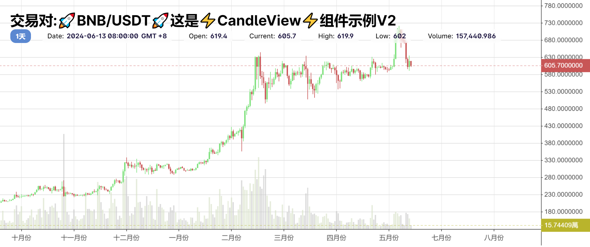

# **🚀CandleView🚀 For Reactjs !**



---

一个用于在 reactjs 中使用的 K 线图组件

---

#### 功能概要

组件用于显示 k 线图以及交易量数据。

---

组件的主要功能:

1. X 轴为日历格式显示,所有在 x 轴上标出的时间为整数时间，可以配置 Formatter

2. Y 轴为自动寻找整数显示，不会显示过多的小数，可以配置 Formatter

3. 支持静态的 k 线数据

4. 支持动态加载 k 线数据

5. 支持动态接入 Websocket 实时价格数据

6. 支持自动聚合时间单位更小的数据，例如您现在给组件设置的单位是月，但是输入的数据的单位为天的，组件将自动聚合到月为单位的数据。

7. 支持时区配置，可以配置输入数据的所在时区 / 显示时以哪个时区显示 / 请求数据时，发送的参数为哪个时区。

8. 时间标签支持中文/英文显示

9. 支持web移动端

---

## 如何使用

```bash
yarn add @bobliao/candle-view@latest
```

```bash
npm i @bobliao/candle-view@latest
```

引用到您想使用的位置:

```javascript
import {
  useCandleView,
  candleViewContext,
  CandleView,
} from '@bobliao/candle-view';
```

使用钩子初始化 CandleView:

```javascript
//这里仅作演示，下文将提及详细的配置字段和使用
const candleViewHook = useCandleView({
  timeFormat: '1d',
  height: 'auto',
  timeZone: {
    dataSourceTimeZone: 8,
    fetchConditionTimeZone: 8,
    displayTimeZone: 8,
  },
  data: {
    dynamicData: {
      enabled: true,
      dataFetchCallback: async function(timeFormat, startTime, endTime) {
        let time = '';
        if (timeFormat === '1d') {
          time = '1d';
        }
        if (timeFormat === '1h') {
          time = '1h';
        }
        if (timeFormat === '1min') {
          time = '1m';
        }
        let response = await fetch(`
                        https://api.binance.com/api/v3/klines?symbol=BNBUSDT&interval=
                        ${time}
                        &startTime=
                        ${startTime}
                        &endTime=
                        ${endTime}
                    `).then(function(d: any) {
          return d.json();
        });

        let bars: IcandleItem[] = [];

        for (var item of response) {
          bars.push({
            time: item[0],
            low: item[3],
            high: item[2],
            open: item[1],
            close: item[4],
            volume: Number(item[5]),
          });
        }
        return bars;
      },
    },
  },
});
```

将 CandleView 放到您的组件中去:

```javascript
<div className={'candleviewContainer'}>
  <candleViewContext.Provider value={candleViewHook}>
    <CandleView></CandleView>
  </candleViewContext.Provider>
</div>
```

## 示例

-----

静态数据：

动态数据：

样式 / 语言 / 显示时区更改：
